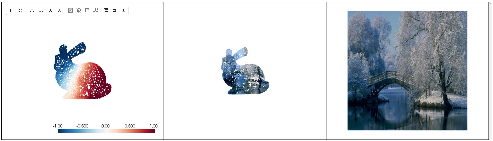
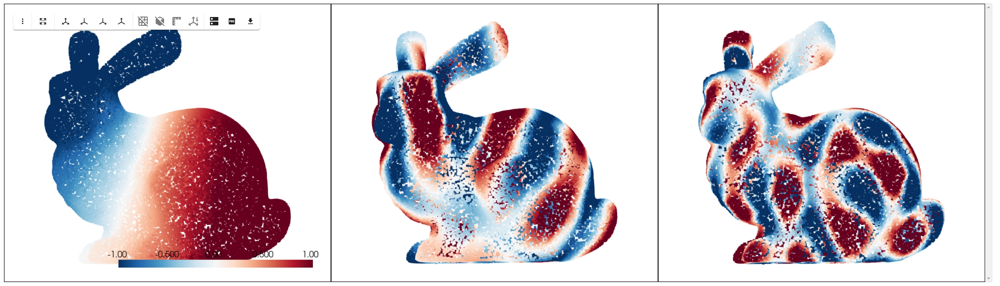
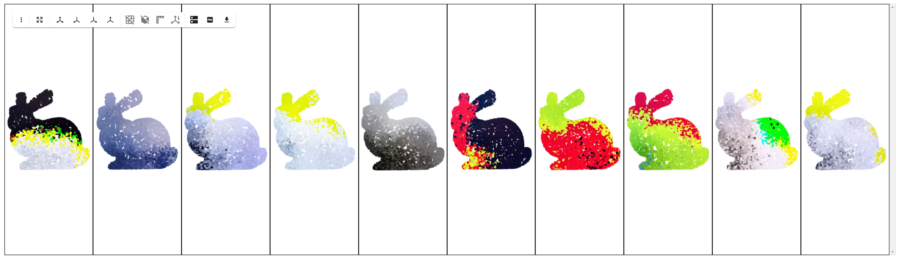

# A Toy Implementation of Manifold Diffusion Fields

### **Datasets**:
 - objects: https://github.com/alecjacobson/common-3d-test-models
 - images: https://www.kaggle.com/datasets/jehanbhathena/weather-dataset

### **Installation**:
 - pyenv use 3.11.0
 - poetry shell
 - poetry install

### **Showcase**:

#### Texture Mapping using Sampled Points on the 3D Mesh:


#### Interpolated Eigenfunction Values:


#### DDPM Sampling using $f \colon M \mapsto Y$ Learned Distribution


### **Paper made by**:
```
@misc{elhag2024manifold,
      title={Manifold Diffusion Fields},
      author={Ahmed A. Elhag and Yuyang Wang and Joshua M. Susskind and Miguel Angel Bautista},
      year={2024},
      eprint={2305.15586},
      archivePrefix={arXiv},
      primaryClass={cs.LG}
}
```